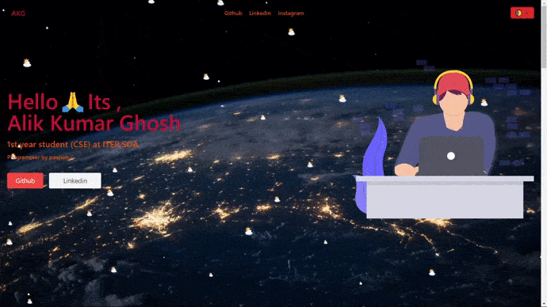

# summerhacks-projectName
SOA code room Hackathon SummerHacks

---

### Live Site

live site : http://akgware.rf.gd/?i=1

### Theme Used and Color Theme
`Summer Theme`
`Color Theme used 9`
[https://summerhacks.netlify.app/theme.html](https://summerhacks.netlify.app/theme.html) <br>

### Technologies Used
`<HTML, CSS, JS> ` <br>
`<TailWind CSS> `<br>
`<Purge CSS>` <br>

[https://purgecss.com/](https://purgecss.com/) <br>
[https://tailwindcss.com/](https://tailwindcss.com/) <br>


---

### Installation 

```

npm install 

```

if it doesn't work then you have to install tailwind css manually:

```

npm install -D tailwindcss@npm:@tailwindcss/postcss7-compat @tailwindcss/postcss7-compat postcss@^7 autoprefixer@^9

```

```

npm insatll purgecss

```

---

### Optimization

```

Used : PurgeCSS to remove unused CSS.

```
 
 ### ScreenCast
 
 
 
 ---

 ### License
 
 © Alik Kumar Ghosh, licensed under the GNU General Public License v3.0 [License]()


